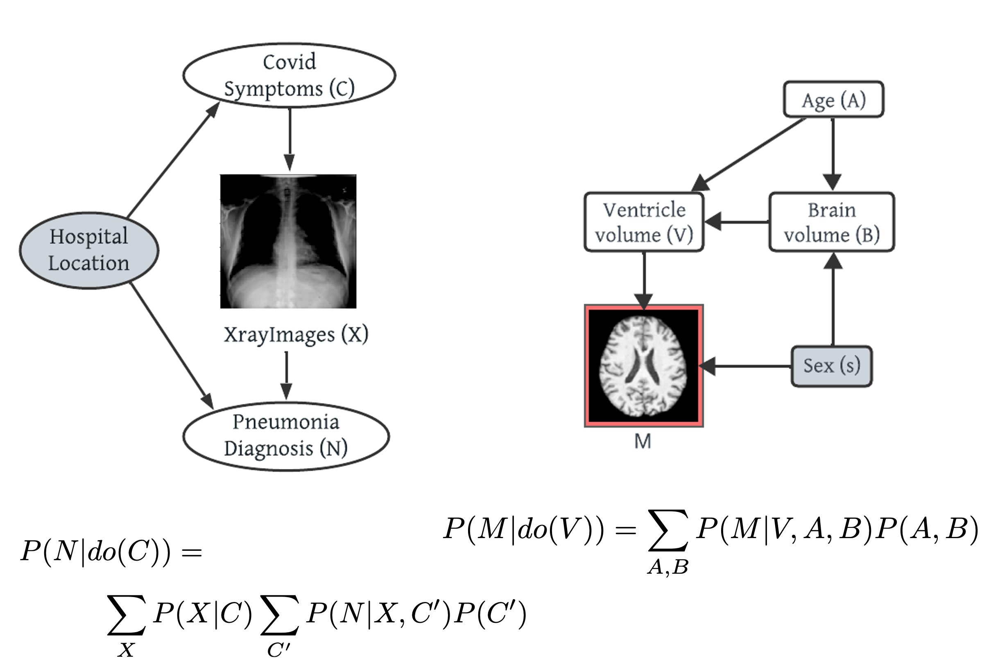
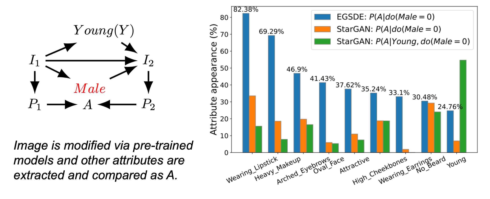

# Conditional Generative Models are Sufficient to Sample from Any Causal Effect Estimand

## Abstract
Causal inference from observational data plays a critical role in many applications in trustworthy machine learning. While sound and complete algorithms exist to compute causal effects, many of them assume access to conditional likelihoods, which are difficult to estimate for high-dimensional (particularly image) data. Researchers have alleviated this issue by simulating causal relations with neural models. However, when we have high-dimensional variables in the causal graph along with some unobserved confounders, no existing work can effectively sample from the un/conditional interventional distributions.

In this work, we show how to sample from any identifiable interventional distribution given an arbitrary causal graph through a sequence of push-forward computations of conditional generative models, such as diffusion models. Our proposed algorithm follows the recursive steps of the existing likelihood-based identification algorithms to train a set of feedforward models and connect them in a specific way to sample from the desired distribution. 

We conduct experiments on a Colored MNIST dataset having both the treatment (X) and the target variables (Y) as images and sample from \( P(Y | do(X)) \). Our algorithm also enables us to conduct a causal analysis to evaluate spurious correlations among input features of generative models pre-trained on the CelebA dataset. Finally, we generate high-dimensional interventional samples from the MIMIC-CXR dataset involving text and image variables.

---

## Resources
- **[Paper link with Openreview author-reviewer discussion](https://openreview.net/forum?id=vymkuBMLlh)**
- **[Slideslive Presentation](https://recorder-v3.slideslive.com/?share=96768&s=09f41687-e6b3-4daa-ab8e-e751bf277f67)**

---

## Motivation

### Tweet Highlights:
Original post: https://x.com/murat_kocaoglu_/status/1865548742297874501

1. **Complex Systems & High-Dimensional Variables**: If you are interested to know how causal inference (😎) can solve trustworthy (🧐) ML problems involving high-dimensional (🤯) variables, this research offers a practical solution.
2. **Causal Questions**: You have a complicated system with several high-dimensional variables, such as image and text data. How can you systematically answer **ANY** causal question from observational data?
3. **ID Algorithms**: With enough data, we know which causal questions can be answered and which cannot thanks to the ID algorithms of Tian & Pearl and Shpitser & Pearl. But these require the likelihood of complicated high-dimensional distributions, which can't be explicitly learned from data.



4. **Deep Generative Models**: Deep generative models allow us to sample from such conditional distributions, learning them implicitly. Our fundamental question: Can we sample from any identifiable causal query (distribution) just by using conditional generative models?
5. **Proposed Solution**: Our paper answers this positively. We propose an algorithm that trains a set of conditional generators, tying them together to sample from any causal effect estimand. This unlocks the potential of diffusion models for causal inference.
6. **Soundness and Completeness**: Our algorithm mimics the steps of the ID algorithm, inheriting its soundness and completeness guarantees for arbitrary causal queries. It can seamlessly sample from conditional interventional queries faster than rejection sampling.
7. **Quantifying Spurious Correlations**: With our method, we can quantify how spurious correlations in their training data affect large image generative models. For example, we quantify how changing the biological sex of a person affects their perceived age, a non-causal relation that shouldn't be present.



---


## Experiment: CelebA: Image to Image Translation
We all have seen these types of Male to Female image translation by generative models which is quite impressive. But have you ever wondered what facial features a model exactly introduce while this translation?

Does it introduce facial features such as "wearing lipstick" or "makeup" ?
What other features is it adding to the translated images? Is it adding some
features that it should not?

In this paper, we evaluated an image generative model that were pre-trained on the popular CelebFaces Attributes (CelebA) Dataset with a classifier and we observed the following bar plot from 850 samples.

We observed that addition of some attributes are logical such as 81% of all input images had "Wearing_Lipstic" as new attribute. Similarly, "Heavy_Makeup"(68%), "Wearing_Earrings" (33%) or "No_Beard" (27%). These attributes can be considered causally related to Sex (Male/Female) attribute.

Some attributes are added even though they are non-causal. For example: 36% of the translated images are detected having the "Attractive" attribute (an attribute of the CelebA dataset) and 24% of images are having the "Young" attribute.

We analyzed the reason behind this as following:
The CelebA dataset contains images with high frequency of [young, female] or [attractive, female] labels compared to other combinations. The image translation model memorize the correlation between "Female" and "Young" or between "Female" and "Attractive" during their training. As a result, during translation they do not consider if an attribute is causally related to Sex or not,
they add it based on the spurious correlation they learned. Thus, we see more young female in the translated images which was not the goal.

In our paper, we proposed a sound and complete algorithm called ID-DAG that can estimate causal effects involving high-dimensional variables such as images. It can generate high-dimensional interventional samples given that we know the causal graph and the causal query is identifiable from observational data. 


## Citation
If you use this work, please cite our paper:

```

@inproceedings{
rahman2024conditional,
title={Conditional Generative Models are Sufficient to Sample from Any Causal  Effect Estimand},
author={Md Musfiqur Rahman and Matt Jordan and Murat Kocaoglu},
booktitle={The Thirty-eighth Annual Conference on Neural Information Processing Systems},
year={2024},
url={https://openreview.net/forum?id=vymkuBMLlh}
}

```

## Contact

For questions or discussions about **ID-GEN**, please reach out:

- **Md Musfiqur Rahman**  
  - Email: [rahman89@purdue.edu](mailto:rahman89@purdue.edu)  
  - Twitter: [@Musfiqshohan](https://twitter.com/Musfiqshohan)
